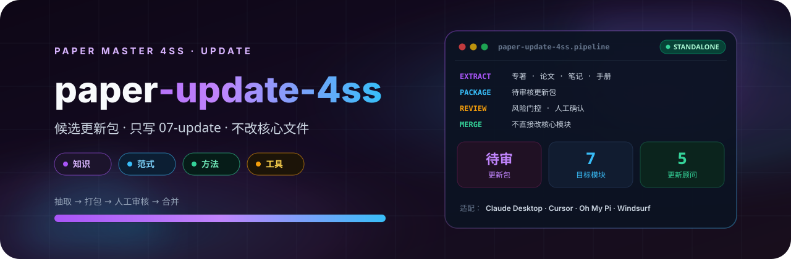

<p align="center">
  
</p>

# Paper 知识更新 4SS

社会科学论文技能包全包候选更新系统。用于从学术专著、教材、期刊论文、综述、课程材料、研究笔记、方法手册和本地经验中生成待人工审核的更新包，可指向 design、lit、outline、analysis、write、submission 与 update 自身。只输出到 paper-workspace/07-update/，不得直接修改任何核心模块文件。

## 4SS 家族

| 包 | 职责 |
|---|---|
| [paper-master-4ss](https://github.com/JingYangYuan/paper-master-4ss) | 总控：登记输入、选择模块、维护工作区 |
| [paper-design-4ss](https://github.com/JingYangYuan/paper-design-4ss) | 选题、框架路由、研究设计蓝图 |
| [paper-lit-4ss](https://github.com/JingYangYuan/paper-lit-4ss) | 中英文检索、文献地图、空白与假设 |
| [paper-outline-4ss](https://github.com/JingYangYuan/paper-outline-4ss) | 素材转大纲、证据映射、缺口报告 |
| [paper-analysis-4ss](https://github.com/JingYangYuan/paper-analysis-4ss) | 定量 / 质性 / 混合，Stata · R · Python |
| [paper-write-4ss](https://github.com/JingYangYuan/paper-write-4ss) | 章节写作、润色、语言扫描、正文净稿 |
| [paper-submission-4ss](https://github.com/JingYangYuan/paper-submission-4ss) | Word 导出、体例、投稿清单与信函 |
| **[paper-update-4ss](https://github.com/JingYangYuan/paper-update-4ss)**（本仓库） | 待审核更新包，不直接改核心文件 |

## 它做什么

从专著、教材、论文、课程材料、笔记和方法手册生成**待人工审核**的更新包，可指向 design、lit、outline、analysis、write、submission 与 update 自身。

只写到 `paper-workspace/07-update/`，不得直接修改任何核心模块文件。合并进总控必须经人工确认。

## 安装

将本目录放到宿主的 skill 目录。入口见 `SKILL.md`。

```bash
git clone https://github.com/JingYangYuan/paper-update-4ss.git
```

与 [`paper-master-4ss`](https://github.com/JingYangYuan/paper-master-4ss) 同级安装时，跨模块路径才能解析。只做本模块任务也可以单独使用。

## 与总控的关系

本包由总控 [`paper-master-4ss`](https://github.com/JingYangYuan/paper-master-4ss) 导出；对应源目录是总控包内的 `modules/update/`：

- 包内相对路径相对本包根目录解析
- `master/` 与部分 `references/` 是导出时的协议快照
- 更新方式：修改总控对应模块后重新导出，不要直接改本仓库

## License

[MIT](LICENSE)
