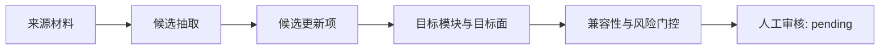

# Phase 06: 待审核更新包

## 顾问派发闸门

生成待审核更新包前，必须派发 `agents/review-gate-consultant.md`，复核来源、证据等级、目标位置、风险等级、验证方式、pending 状态和人工审核清单。self-update 候选必须已有 `target-routing-consultant` 与 `review-gate-consultant` 双重审核记录。未通过项必须写入 `agent-synthesis-update-[YYYY-MM-DD].md`、`review-checklist-[slug]-[date].md` 和最终回复。

## 目标

生成完整的待审核更新包、人工审核清单和合并说明。不得修改核心模块。所有候选必须保持 `pending`。

本 phase 的待审核更新包、审核清单和合并说明必须遵守 `master/output-protocol.md`。候选抽取、文献补强、目标路由、风险门控和人工审核链路必须包含 Mermaid 图示，例如：



图后用 2-4 条中文解释说明来源、候选项、目标位置、证据等级、风险等级和审核风险。

## 输出结构

```text
paper-workspace/07-update/
├── update-report-[slug]-[date].md
├── review-checklist-[slug]-[date].md
├── proposed-diffs/
│   ├── knowledge/
│   ├── workflow/
│   ├── agents/
│   ├── templates/
│   ├── scripts/
│   └── self-update/
├── evidence/
└── merge-instructions-[slug]-[date].md
```

## update-report 模板

```markdown
# Update Report

## Summary
- Purpose:
- Source:
- Candidate count:
- Review status: pending
- Contains self-update: true/false

## Candidate Targets

| Candidate ID | Purpose | Target module | Target surface | Target file | Suggested location | Risk tier | Required validation | Evidence file | Review status |
|---|---|---|---|---|---|---|---|---|---|

## Notes
- Not merged.
- Requires human review.
- High-risk candidates require manual validation before merge.
```

## review-checklist 模板

```markdown
# Review Checklist

| Candidate ID | Source clear | Evidence adequate | Target correct | Risk tier set | Validation adequate | Self-update double review | Decision |
|---|---|---|---|---|---|---|---|
| C001 | pending | pending | pending | pending | pending | pending/not-applicable | pending |
```

## merge-instructions 模板

```markdown
# Merge Instructions

Do not apply automatically.

For each accepted candidate:
1. Open target file.
2. Locate suggested heading.
3. Insert or adapt candidate content.
4. If risk tier is medium/high, run the listed validation.
5. Record reviewer, date, decision, validation result, and any rollback notes.
```

最终回复只能列出待审核更新包路径，不得说已经合并。
